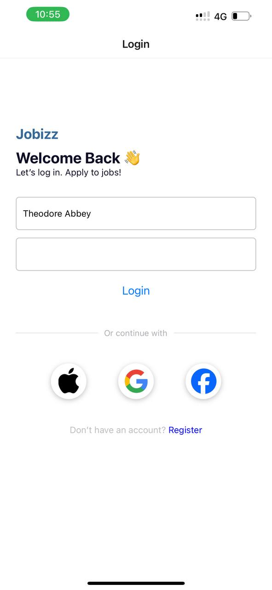
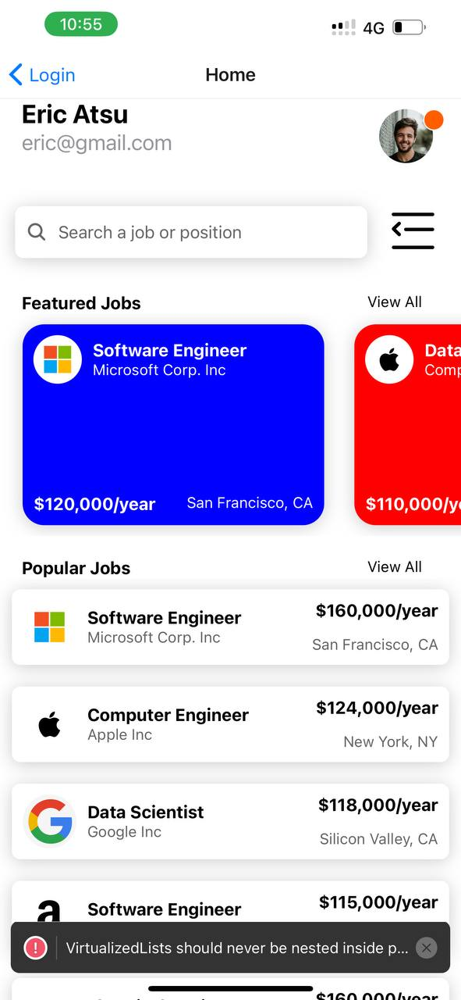

# User Information
- Name: Theodore Gyaqueh Abbey
- Student ID: 11343393

# Prerequisites

- Node.js
- npm or yarn
- React Native CLI

# JOB App

This project is aimed at recreating an application based on a provided UI mockup. The application includes various categories and an ongoing task list, utilizing React Native's core components. The email-screen displays the login of the user.


## Introduction

This project is a job application that helps users organize and keep track of their tasks. The design follows a provided UI mockup, ensuring a visually appealing and user-friendly interface.

## Features

- Recreate the design as seen in the UI mockup.
- Use core React Native components:
  - `View`
  - `Text`
  - `ScrollView`
  - `TextInput`
  - `Stylesheet`
  - `Button`
  - `FlatList` or `SectionList` for rendering lists of tasks.
  - `Image` for icons and displaying images

## Components

### View

Used to create the basic structure of the app's user interface.

### Text

Used to display text in the application, such as task titles and descriptions.

### ScrollView

Allows scrolling of the content within the app, useful for viewing lists of tasks that extend beyond the screen size.

### TextInput

Used to input text, such as adding new tasks or updating existing ones.

### StyleSheet

Manages styles for the components to match the UI mockup.

### Button

Interactive buttons for actions like adding tasks or navigating between different sections of the app.

### FlatList / SectionList

Renders lists of tasks. FlatList is used for a simple list, while SectionList is used for categorized lists.

### Image

Displays icons and images within the app.

## Categories

The app includes at least eight categories:
- Exercise
- Study
- Code
- Cook
- Read
- Travel
- Work
- Relax

## Tasks

The application will provide a list of 15 ongoing tasks, distributed across the categories.

## Custom Components

The app utilizes custom components for modularity and code reusability. Each custom component is designed to handle specific parts of the user interface, enhancing the overall maintainability and scalability of the codebase.    


## Installation

1. Clone the repository:
    ```sh
    git clone https://github.com/theodoreabbey173/rn-assignment4-11343393.git
    cd task-management-app
    ```

2. Install the dependencies:
    ```sh
    npm install
    ```

3. Start the development server:
    ```sh
    npm start
    ```

4. Run the application on an emulator or physical device:
    ```sh
    npx react-native run-android
    # or
    npx react-native run-ios
    ```

## Usage

1. Open the app on your emulator or physical device.
2. Navigate through the categories such as Exercise, Study, Code, Cook, etc.
3. View the list of ongoing tasks.
4. Add, edit, or remove tasks as needed.


 # Screenshot
 
 